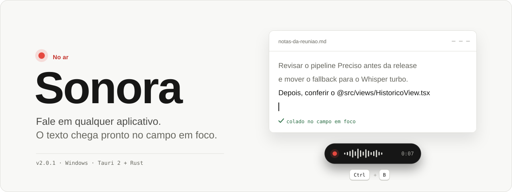
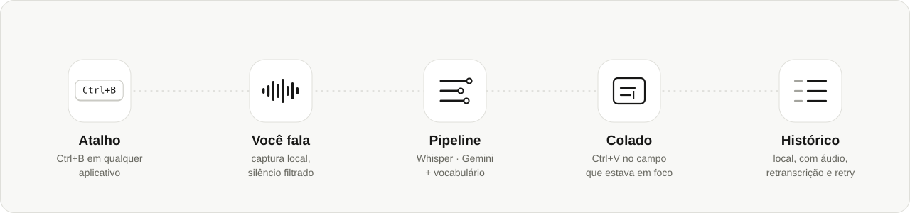
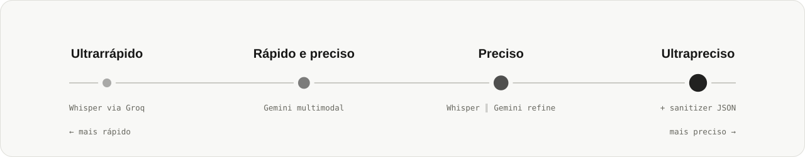

<picture>
  <source media="(prefers-color-scheme: dark)" srcset="docs/assets/hero-dark.svg">
  
</picture>

<p align="center">
  <a href="https://github.com/riique/Sonora/actions/workflows/windows.yml"></a>
  
  
  
</p>

<p align="center">
  <a href="#como-funciona"><b>Como funciona</b></a> &nbsp;·&nbsp;
  <a href="#pipelines">Pipelines</a> &nbsp;·&nbsp;
  <a href="#comece-agora">Comece agora</a> &nbsp;·&nbsp;
  <a href="#arquitetura">Arquitetura</a> &nbsp;·&nbsp;
  <a href="#documentação">Documentação</a>
</p>

<br>

**Sonora** é um aplicativo desktop de **digitação por voz** para Windows. Aperte um atalho global, fale, aperte de novo: o áudio é transcrito por motores em nuvem, opcionalmente refinado, e o texto é colado no campo que estava em foco, em qualquer aplicativo.

A janela principal é o estúdio onde você revisa gravações e ajusta o equipamento. No dia a dia, quem trabalha é o **gadget**: uma pílula preta, sempre no topo, que só acende quando você está no ar.

> *Quiet by default. Information appears when needed.*

<br>

## Como funciona

<picture>
  <source media="(prefers-color-scheme: dark)" srcset="docs/assets/flow-dark.svg">
  
</picture>

| | |
|:--|:--|
| <kbd>Ctrl</kbd> + <kbd>B</kbd> | Inicia e encerra a gravação, de qualquer aplicativo |
| <kbd>Ctrl</kbd> + <kbd>Q</kbd> | Cancela sem gerar texto novo |
| <kbd>Ctrl</kbd> + <kbd>Shift</kbd> + <kbd>B</kbd> | Comando de voz sobre o texto selecionado |

Os atalhos podem ser reconfigurados em **Ajustes › Geral**, onde também dá para escolher entre apertar ou segurar para falar.

<br>

## Novidades desta versão

- **Ultrarrápido com provedor à escolha:** OpenRouter (Groq fixo) ou Groq direto com a sua chave, com o mesmo modelo Whisper, o mesmo vocabulário e o mesmo refino.
- **Refinar com IA no Ultrarrápido:** uma passada rápida de IA aplica vocabulário, estilo do aplicativo e contexto autorizado ao texto do Whisper. Pode ser desligada em Ajustes › Transcrição.
- **Comando de voz (`Ctrl+Shift+B`):** selecione um texto, aperte o atalho e diga o que fazer (“deixa mais formal”, “traduz para inglês”). Sem seleção, o Sonora escreve o que você pedir.
- **Segurar para falar:** em Ajustes › Geral › Atalhos, escolha entre apertar para alternar ou segurar enquanto fala.
- **Snippets no meio da frase:** “meu perfil é snippet meu github” expande só o trecho do snippet.
- **Vocabulário que aprende:** ao corrigir a mesma palavra duas vezes no Histórico, o Sonora oferece guardá-la.
- **Histórico explica o que aconteceu:** cada ditado mostra o que foi aplicado (IA, vocabulário, style, snippet, offline) e o custo; o topo mostra o total do mês.
- **Sem internet:** com o modelo local baixado (whisper.cpp), o ditado é transcrito no computador quando todos os provedores falham.
- **Atualização automática:** novas versões publicadas no GitHub são instaladas ao abrir o app.
- **Removido:** o caminho legado de motores (Deepgram e motor duplo), que não era mais executado.

### Publicar uma versão (atualização automática)

1. Uma única vez: em *Settings › Secrets and variables › Actions* do repositório, crie `TAURI_SIGNING_PRIVATE_KEY` (conteúdo da chave privada do updater) e `TAURI_SIGNING_PRIVATE_KEY_PASSWORD`. A chave pública correspondente está em `src-tauri/tauri.conf.json`.
2. Suba a versão em `package.json`, `package-lock.json`, `src-tauri/tauri.conf.json`, `src-tauri/Cargo.toml` e no topo deste README.
3. Crie e envie a tag da versão, por exemplo `git tag v2.1.1 && git push origin v2.1.1`.

O workflow **Release** gera o instalador assinado e o `latest.json`; as instalações existentes encontram a versão nova sozinhas.

<br>

## Novo na versão 2.0

**Sua voz, mais simples.** Um retrato curto, suas expressões e hábitos de fala, com medições e configurações nos detalhes. O botão do retrato fica à vista com a quantidade de palavras que falta e é habilitado quando você pode gerar uma nova versão.

**Silêncio tratado no computador.** Uma gravação claramente sem voz mostra “Nenhuma voz encontrada” na barra e encerra sem enviar áudio nem colar texto. Falas curtas e baixas são preservadas por uma verificação conservadora.

**Troca de aplicativo.** O ditado usa o campo em foco ao parar, com identificação estável entre a gravação e a entrega, e orienta em português quando o campo muda depois.

**Nova identidade.** Sonora na interface, no executável e nos instaladores. Seus dados e perfis existentes continuam disponíveis.

→ [Mudanças, compatibilidade e atualização da instalação anterior](docs/SONORA_2.0.md)

<br>

## Pipelines

<picture>
  <source media="(prefers-color-scheme: dark)" srcset="docs/assets/modes-dark.svg">
  
</picture>

Escolha o equilíbrio entre velocidade e precisão em **Configurações**. Cada pipeline aceita um modelo customizado via Google AI Studio ou OpenRouter.

| Modo | Fluxo | Sanitizer | Fallback típico |
|:--|:--|:--:|:--|
| **Ultrarrápido** | Whisper via OpenRouter STT (Groq) ou Groq direto | — | — |
| **Rápido e preciso** | Gemini (Files API ou inline) | — | Whisper (configurável) |
| **Preciso** | Whisper ∥ upload → refine Gemini | — | Whisper ou Gemini puro |
| **Ultrapreciso** | Whisper ∥ upload → sanitizer → Gemini | JSON | Texto sanitizado ou Whisper |

No Ultrarrápido, escolha entre `whisper-large-v3-turbo` e `whisper-large-v3`, pelo OpenRouter (Groq fixo) ou direto na Groq com a sua chave. No OpenRouter, Chat Completions multimodal e Speech-to-Text dedicado são roteados separadamente.

**Prompt universal.** Os modelos Gemini multimodais recebem uma única `systemInstruction` que trata, trecho a trecho, conversa comum, programação e conteúdo acadêmico. Não é preciso escolher um tipo de conteúdo antes de falar.

**FileTagging.** Um botão em Configurações converte referências faladas e inequívocas a arquivos em menções como `@src/components/Header.tsx`. O Sonora prepara a menção no texto; a integração com o IDE ou chat fica a cargo do aplicativo de destino.

<br>

## O que vem junto

<table>
<tr>
<td width="50%" valign="top">

**Captura**

- Microfone por atalho global ou pelo botão na interface
- Normalização sensível a ruído: ganho adaptativo limitado, pausas sem amplificar o ruído de sala, limiter em −3 dBFS e original preservado como `.original.wav`
- Captura incremental com limite de 15 minutos e recuperação de áudio interrompido
- Upload de arquivos de áudio (WAV, MP3 e outros)

</td>
<td width="50%" valign="top">

**Entrega**

- Cola automática no campo focado (clipboard + paste simulado)
- Verificação do campo de destino antes do paste
- Se a entrega falhar, o resultado continua no Histórico
- No gadget, uma falha oferece **Regenerar** com o áudio já salvo, sem abrir o Histórico

</td>
</tr>
<tr>
<td width="50%" valign="top">

**Histórico**

- Local, sem limite artificial, paginado e incremental
- Modo, modelos, estágios, textos intermediários, fallback e latências de cada ditado
- Copiar, editar, excluir, retranscrever e avaliar a pronúncia
- Áudio revelável no Explorer, em uma pasta que você escolhe

</td>
<td width="50%" valign="top">

**Vocabulário e controle**

- Vocabulário estruturado: grafia canônica, aliases, categoria e literais *strict*
- Telemetria apenas local: latência por estágio, RTF estimado e throughput
- Diagnóstico local, backup com áudio opcional e arquivamento
- Seleção rápida de destino e Style

</td>
</tr>
</table>

<br>

## Comece agora

### Requisitos

- **Node.js 24** com npm
- **Rust 1.97.1** via [rustup](https://rustup.rs/)
- Chaves de API, conforme o pipeline:

| Provedor | Usado em |
|:--|:--|
| **OpenRouter** | Obrigatório no Ultrarrápido; também aceita modelos multimodais com áudio e modelos dedicados de transcrição |
| **Google Gemini** | Rápido e preciso, Preciso, Ultrapreciso e avaliação de pronúncia |
| **Groq** | Preciso, Ultrapreciso, sanitizer e fallback manual |

### Desenvolvimento

```bash
npm install
npm run tauri dev     # app completo
npm run dev           # só a interface, sem o backend nativo
```

### Build de produção

```bash
npm run tauri build
```

<details>
<summary>O <code>cargo</code> não está no <code>PATH</code> (Windows / PowerShell)?</summary>

```powershell
$env:PATH = "$env:USERPROFILE\.cargo\bin;" + $env:PATH
npm run tauri build
```

</details>

| Artefato | Caminho |
|:--|:--|
| Executável | `src-tauri/target/release/sonora.exe` |
| Instaladores | `src-tauri/target/release/bundle/nsis/` e `bundle/msi/` |

Detalhes em [`BUILD.md`](BUILD.md).

### Primeiro ditado

1. Abra **Configurações** e salve as chaves de API do pipeline que vai usar.
2. Escolha um pipeline: Ultrarrápido, Rápido e preciso, Preciso ou Ultrapreciso.
3. Clique no campo de texto onde o texto deve chegar e aperte <kbd>Ctrl</kbd> + <kbd>B</kbd>.
4. Fale. Aperte <kbd>Ctrl</kbd> + <kbd>B</kbd> de novo para parar: o texto é colado no campo e entra no **Histórico**.
5. Mudou de ideia? <kbd>Ctrl</kbd> + <kbd>Q</kbd> cancela sem gerar texto.

> [!NOTE]
> A gravação pelo microfone **cola** no campo focado; o upload de arquivo **não** cola automaticamente. Arquivos de áudio acima de ~50 MB são rejeitados.

<br>

## Seus dados

Tudo fica no seu computador, em `%APPDATA%\com.haumeavoice.app\`: histórico, configurações, chaves e áudios.

- As chaves de API são protegidas pelo **DPAPI** da sua conta Windows; a interface recebe apenas referências opacas.
- Escritas são atômicas, e itens removidos podem ser recuperados.
- O contexto do navegador só é coletado mediante solicitação vigente, conforme as fontes habilitadas.
- Não há analytics externo.

O identificador interno de dados mantém o nome legado para preservar sua instalação. Para migrar para a pasta Sonora com backup e verificação, siga [o procedimento Windows](docs/SONORA_2.0.md#instalação-windows).

<br>

## Arquitetura

A orquestração vive em módulos dedicados (`transcription/`, `gemini/`, contratos e vocabulário), e a tela de **Configurações** é centrada nos pipelines de produto ativos.

```text
src-tauri/src/
├── audio.rs                 captura do microfone, WAV, clipboard e paste
├── transcription/           modos de produto, legado e telemetria
├── gemini/                  Files API, STT, refine e pronúncia
├── pipeline_contract.rs     TranscriptionMode, configuração e estágios
├── vocabulary.rs            termos estruturados
├── sanitizer_json.rs        parse da saída JSON do sanitizer
├── groq.rs                  Whisper e sanitizer
└── history.rs · settings.rs

src/views/
├── ConfiguracoesView.tsx    pipelines, FileTagging e vocabulário
├── HistoricoView.tsx        lista, detalhes e ações
└── TranscricaoView.tsx      upload de arquivo
```

| Tela | Para quê |
|:--|:--|
| **Início** | Status, contadores e gravação |
| **Transcrição** | Upload de arquivo |
| **Histórico** | Ditados, métricas, retranscrição e pronúncia |
| **Atalhos** | Reconfigurar gravar e cancelar |
| **Configurações** | Pipelines, chaves, vocabulário e avançado |
| **Gadget** | Pílula compacta, sempre no topo |

| Camada | Tecnologia |
|:--|:--|
| Shell | Tauri 2 |
| Interface | React 18 · TypeScript · Vite 5 · Tailwind CSS 3 |
| Backend | Rust: captura, STT, IPC e sistema operacional |
| Áudio | cpal (WASAPI no Windows) |
| STT e LLM | Groq Whisper · Google Gemini · OpenRouter · whisper.cpp local (offline) |
| Clipboard e paste | arboard · enigo |

<br>

## Testes

```bash
cd src-tauri && cargo test
```

O CI no Windows roda lint, testes de frontend e de UI, build, `cargo fmt`, `clippy` e `cargo test` a cada push. Para a verificação manual, use o [checklist](docs/MANUAL_TEST_CHECKLIST.md).

<details>
<summary><b>Correções da auditoria 1.0.34</b></summary>

<br>

- Chaves protegidas por DPAPI da conta Windows; somente referências opacas chegam à interface.
- Escritas atômicas, histórico incremental paginado e recuperação de itens removidos.
- Captura incremental com limite de 15 minutos, recuperação de áudio interrompido e cancelamento do processamento de ditados.
- Coleta de contexto do navegador somente por solicitação vigente, conforme as fontes habilitadas.
- Verificação do campo de destino antes do paste; resultado e falha de entrega permanecem disponíveis no Histórico.
- Diagnóstico local, backup com áudio opcional, arquivamento e seleção rápida de destino e Style.
- Dependências corrigidas, permissões separadas por janela e CI Windows com verificações de contratos.

Qualificação e limites em [auditoria implementada](docs/audit-remediation.md).

</details>

<br>

## Documentação

| | |
|:--|:--|
| [Sonora 2.0](docs/SONORA_2.0.md) | Mudanças, compatibilidade e migração da instalação |
| [Build](BUILD.md) | Gerar executável e instaladores |
| [Recuperação e release](docs/recovery-and-release.md) | Procedimentos de dados e distribuição |
| [Auditoria implementada](docs/audit-remediation.md) | Qualificação e limites da auditoria |
| [Migração da transcrição](docs/TRANSCRIPTION_MIGRATION_FINAL_REPORT.md) | Relatório técnico dos pipelines |
| [Checklist manual](docs/MANUAL_TEST_CHECKLIST.md) | Roteiro de verificação |
| [Design](DESIGN.md) | O sistema visual “Estúdio no ar” |

<br>

## Licença

Consulte o repositório para a licença aplicável. Chaves de API e dados de uso são de responsabilidade de quem usa o app.

<br>

<p align="center">
  <sub>Feito para quem prefere falar a digitar.</sub>
</p>
